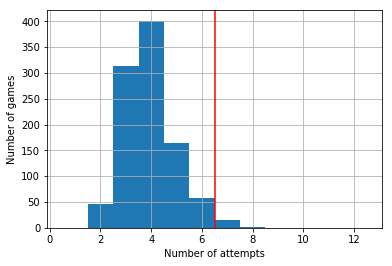

# Wordle Guesser

[View the jupyter notebook here](https://github.com/christopherbronner/wordle_guesser/blob/master/wordle_guesser.ipynb)

[Wordle](https://www.powerlanguage.co.uk/wordle/) is a popular word guessing game in which the player has six attempts at identifying a hidden 5-letter word. After each guess, the player receives feedback that yields some information about the hidden word.

Here, I'm developing a **script that suggests the word for the next guess** based on the previous guesses in a game and the knowledge that was gained from the feedback the player received for them.

By simply eliminating all words that are inconsistent with the feedback provided and randomly choosing the guesses from the remaining words, a simulation shows that **98% of Wordle games can be solved within the allowed six attempts**.

In addition, a word ("irate") is identified as optimal for the first guess (when no information about the hidden word is available) based on a score derived from the frequency of letters in English words.

